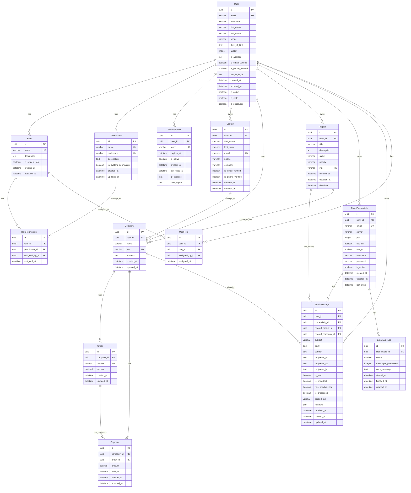

# Схема базы данных CRM Pro

## Обзор

CRM Pro использует PostgreSQL как основную базу данных с UUID для всех первичных ключей. Система построена на Django ORM с дополнительными индексами для оптимизации производительности.

## ER-диаграмма



## Детальное описание таблиц

### 1. Пользователи (User)

**Описание**: Расширенная модель пользователя Django с дополнительными полями для CRM.

**Ключевые поля**:
- `id`: UUID первичный ключ
- `email`: Уникальный email адрес
- `phone`: Номер телефона (с валидацией)
- `avatar`: Фото профиля
- `ip_address`: IP адрес при регистрации
- `is_email_verified`: Статус верификации email
- `is_phone_verified`: Статус верификации телефона

**Индексы**:
- `email` (уникальный)
- `is_active`, `is_staff`, `is_superuser` (составной)
- `created_at` (для сортировки)

### 2. Роли (Role)

**Описание**: Роли для системы RBAC.

**Ключевые поля**:
- `name`: Уникальное название роли
- `is_system_role`: Флаг системной роли
- Связи: Many-to-Many с Permission через RolePermission

### 3. Разрешения (Permission)

**Описание**: Гранулярные разрешения для объектов системы.

**Ключевые поля**:
- `codename`: Уникальный код разрешения
- `is_system_permission`: Флаг системного разрешения

### 4. Контакты (Contact)

**Описание**: Контакты клиентов, поставщиков и партнеров.

**Ключевые поля**:
- `email`: Уникальный email (в рамках пользователя)
- `phone`: Номер телефона
- `company`: Название компании контакта
- `is_email_verified`, `is_phone_verified`: Статусы верификации

**Индексы**:
- `user_id`, `email` (составной уникальный)
- `company` (для поиска)

### 5. Компании (Company)

**Описание**: Организации с ИНН для финансового учета.

**Ключевые поля**:
- `inn`: Уникальный ИНН (10 цифр)
- `name`: Название компании
- `address`: Адрес компании

**Индексы**:
- `inn` (уникальный)
- `user_id`, `name` (для поиска)

### 6. Заказы (Order)

**Описание**: Заказы компаний.

**Ключевые поля**:
- `number`: Уникальный номер заказа (в рамках компании)
- `amount`: Сумма заказа
- Связи: ForeignKey к Company

**Индексы**:
- `company_id`, `number` (составной уникальный)
- `created_at` (для сортировки)

### 7. Платежи (Payment)

**Описание**: Платежи по заказам.

**Ключевые поля**:
- `amount`: Сумма платежа
- `paid_at`: Дата платежа
- Связи: ForeignKey к Company и Order

**Индексы**:
- `company_id`, `order_id` (для группировки)
- `paid_at` (для отчетов)

### 8. Проекты (Project)

**Описание**: Проектные запросы с историей переписок.

**Ключевые поля**:
- `title`: Название проекта
- `status`: Статус (draft, active, completed, on_hold, cancelled)
- `priority`: Приоритет (low, medium, high, urgent)
- `inn`: Связь с компанией через ИНН

**Индексы**:
- `user_id`, `status` (для фильтрации)
- `inn` (для связи с компаниями)
- `created_at`, `deadline` (для сортировки)

### 9. Email учетные данные (EmailCredentials)

**Описание**: Настройки для подключения к email серверам.

**Ключевые поля**:
- `email`: Email адрес
- `server`: SMTP/IMAP сервер
- `port`: Порт подключения
- `use_ssl`, `use_tls`: Настройки безопасности

**Индексы**:
- `user_id`, `email` (составной уникальный)
- `is_active` (для фильтрации)

### 10. Email сообщения (EmailMessage)

**Описание**: Сохраненные email сообщения с парсингом.

**Ключевые поля**:
- `subject`: Тема письма
- `body`: Текст письма
- `sender`: Отправитель
- `is_read`, `is_important`: Флаги статуса
- `parsed_inn`: Распарсенный ИНН из письма
- `headers`: JSON с заголовками

**Индексы**:
- `credentials_id`, `received_at` (для сортировки)
- `is_read`, `is_important` (для фильтрации)
- `parsed_inn` (для связи с компаниями)

### 11. Логи синхронизации (EmailSyncLog)

**Описание**: Журнал синхронизации email.

**Ключевые поля**:
- `status`: Статус синхронизации (success, failed, running)
- `messages_processed`: Количество обработанных сообщений
- `started_at`, `finished_at`: Время выполнения

## Оптимизация производительности

### Индексы

1. **Поисковые индексы**:
   - Email поля для поиска контактов
   - ИНН для связи проектов и компаний
   - Статусы и приоритеты для фильтрации

2. **Сортировочные индексы**:
   - `created_at`, `updated_at` для временных сортировок
   - `received_at` для email сообщений

3. **Составные индексы**:
   - `(user_id, email)` для контактов
   - `(company_id, number)` для заказов
   - `(user_id, status)` для проектов

### Оптимизации запросов

1. **Select related** для связанных объектов
2. **Prefetch related** для Many-to-Many связей
3. **Аннотации** для агрегаций (суммы, количества)
4. **Индексированные поля** для поиска

## Миграции

### Основные миграции
```sql
-- UUID поля вместо Integer
ALTER TABLE crm_user ADD COLUMN id UUID PRIMARY KEY DEFAULT gen_random_uuid();

-- GIN индексы для JSON полей
CREATE INDEX CONCURRENTLY idx_email_headers ON emails_emailmessage USING gin (headers);

-- Частичные индексы для активных записей
CREATE INDEX CONCURRENTLY idx_active_companies ON companies_company (user_id, name) WHERE is_active = true;
```

## Резервное копирование

### Стратегия
- **Полное копирование**: Еженедельно
- **Инкрементальное**: Ежедневно
- **Логи транзакций**: Каждый час

### Команды
```bash
# Создание бэкапа
pg_dump -U crm_user -h localhost crm_db > backup_$(date +%Y%m%d_%H%M%S).sql

# Восстановление
psql -U crm_user -h localhost crm_db < backup_file.sql
```

## Мониторинг

### Метрики для отслеживания
- Размер таблиц
- Количество записей
- Производительность запросов
- Использование индексов

### Запросы для мониторинга
```sql
-- Размер таблиц
SELECT schemaname, tablename, pg_size_pretty(pg_total_relation_size(schemaname||'.'||tablename)) as size
FROM pg_tables
WHERE schemaname = 'public'
ORDER BY pg_total_relation_size(schemaname||'.'||tablename) DESC;

-- Неиспользуемые индексы
SELECT schemaname, tablename, indexname, idx_scan, pg_size_pretty(pg_relation_size(indexrelid)) as size
FROM pg_stat_user_indexes
WHERE idx_scan = 0
ORDER BY pg_relation_size(indexrelid) DESC;
```

## Безопасность

### Уровни защиты
1. **Прикладной уровень**: Django ORM защита от SQL-инъекций
2. **Базовый уровень**: PostgreSQL RLS (Row Level Security)
3. **Сетевой уровень**: SSL/TLS шифрование
4. **Административный**: Аудит логов

### Аудит
- Все изменения логируются
- Доступ к чувствительным данным контролируется
- Регулярные аудиты безопасности